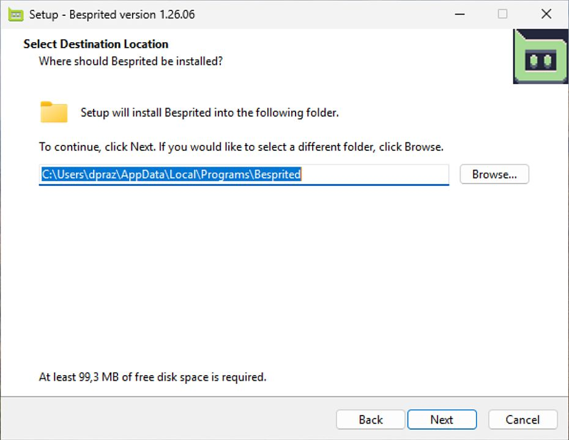
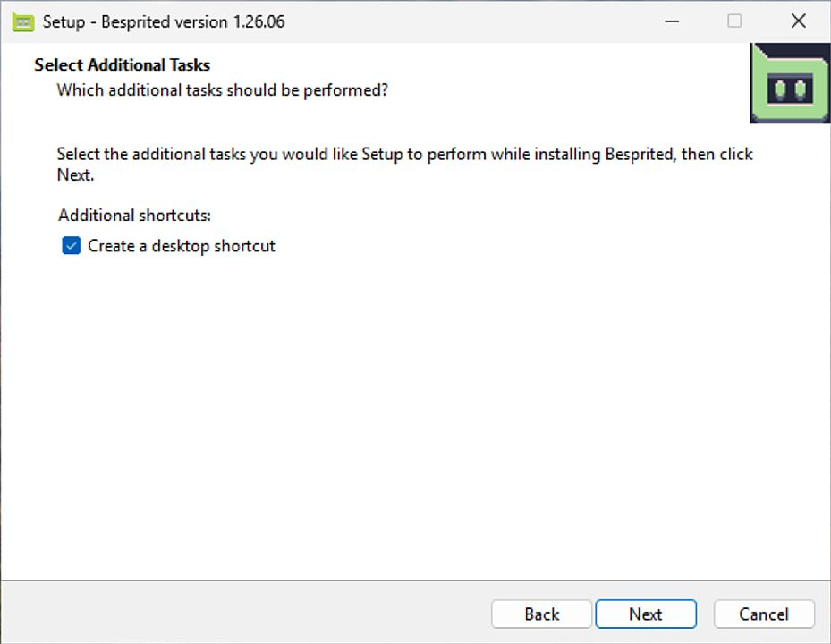
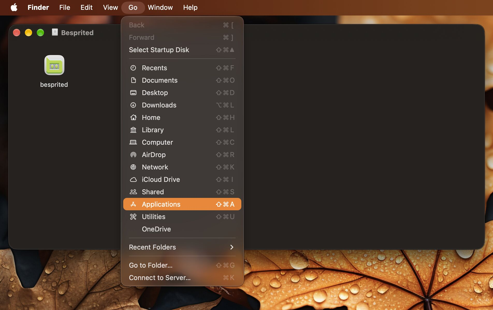
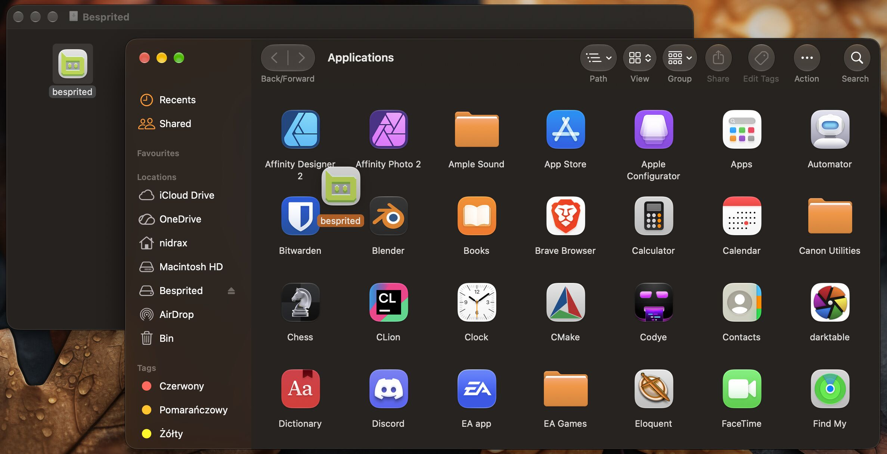
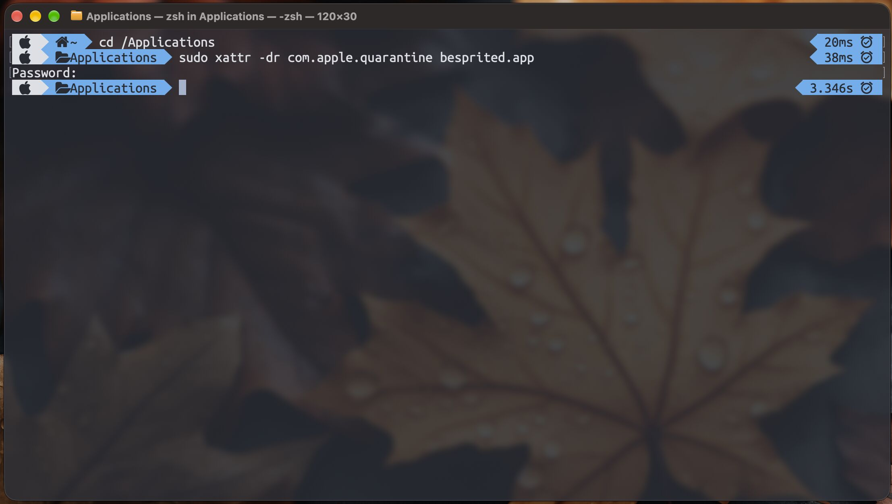
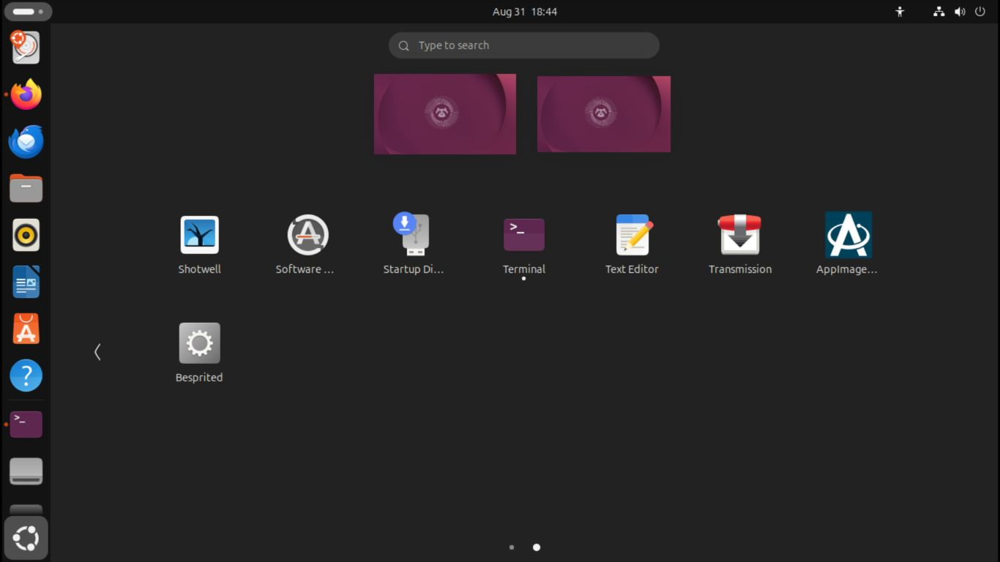

# Installing Besprited

Prebuilt packages for every release are on the
[releases page](https://github.com/Veritaware/Besprited/releases). Pick the
download for your platform below. If you'd rather build from source, see
[BUILDING.md](BUILDING.md).

## Table of contents

* [Windows](#windows)
  * [Installer](#installer)
  * [Portable archive](#portable-archive)
* [macOS](#macos)
* [Linux](#linux)
  * [AppImage](#appimage)
  * [Native packages (.deb / .rpm)](#native-packages-deb--rpm)
  * [Portable .tar.gz](#portable-targz)
  * [Creating a desktop entry by hand](#creating-a-desktop-entry-by-hand)

## Windows

Two downloads are published for each release:

| File | Use it when |
| --- | --- |
| `besprited-<version>-windows-x86_64-installer.exe` | You want a normal installed application. |
| `besprited-<version>-windows-x86_64.zip` | You want a portable copy with no installer. |

### Installer

Run the installer and follow the wizard. It:

* lets you choose the install location (defaults to a per-user directory, so no
  administrator rights are required),
* creates a Start Menu entry and, unless you opt out, a desktop shortcut,
* registers the `.ase` file association,
* can be removed later from *Settings → Apps* (or *Add/Remove Programs*).





### Portable archive

Extract the ZIP anywhere you like — a USB stick, a folder in your home
directory, wherever is convenient. The archive contains `besprited.exe`
together with the DLLs it needs, all in one flat directory; there is no
nested `bin\` folder and nothing to configure. Double-click `besprited.exe`
to run it.

To get a Start Menu / desktop shortcut with the portable copy, right-click
`besprited.exe`, choose *Send to → Desktop (create shortcut)*, or use the
installer instead.

## macOS

Both Apple Silicon (M-series) and Intel Macs are supported. Intel support may
be dropped in the future if GitHub stops providing Intel build runners.

Download the archive for your Mac's architecture — `...-macos-silicon` for
Apple Silicon, `...-macos-intel` for Intel — and unpack it. Double-click the
extracted `besprited.dmg` to mount it.

In the Finder window that opens, choose `Go` → `Applications` from the menu
bar to open your Applications folder alongside it.



Drag the `besprited` app onto the Applications folder.



Apple Developer signing certificates are a paid subscription, and this project
isn't funded well enough to justify one, so the app is self-signed by our
GitHub workflows. Because of that, macOS Gatekeeper puts the app in quarantine
and refuses to open it until you clear that flag.

Open Terminal and run:

```
cd /Applications
sudo xattr -dr com.apple.quarantine besprited.app
```



Besprited will now launch from Spotlight or Launchpad like any other app.

## Linux

Several formats are published for each release. Use whichever fits your
distribution and preferences:

| Format | Best for |
| --- | --- |
| AppImage | Any distro; a single portable file, no installation. |
| `.deb` / `.rpm` | Debian/Ubuntu/Mint and Fedora; dependencies handled by your package manager. |
| `.tar.gz` | A portable filesystem tree with a bundled install script. |

### AppImage

The AppImage (`Besprited-anylinux-x86_64.AppImage`) bundles the `besprited`
executable together with the libraries it needs. To run it you must have
`libfuse2` installed (most distributions still ship it as an optional package).

Make it executable and launch it:

```
chmod +x Besprited-anylinux-x86_64.AppImage
./Besprited-anylinux-x86_64.AppImage
```

AppImages run from any location. If you want it to show up in your application
launcher, move it somewhere stable such as `$HOME/.local/bin` or
`$HOME/Applications`, then either use a helper like
[AppImageLauncher](https://github.com/TheAssassin/AppImageLauncher) / the
[appimaged](https://github.com/probonopd/go-appimage/blob/master/src/appimaged/README.md)
daemon, which register desktop entries automatically, or create one by hand
(see [below](#creating-a-desktop-entry-by-hand)).



### Native packages (.deb / .rpm)

These install Besprited system-wide and let your package manager pull in the
runtime libraries.

Because a `.deb`'s library dependencies are tied to the distro release it was
built on, one is published per supported release — pick the matching file:

* `besprited_<version>_debian13_amd64.deb`
* `besprited_<version>_ubuntu24.04_amd64.deb` (also covers Linux Mint 22)
* `besprited_<version>_ubuntu26.04_amd64.deb`

```
sudo apt install ./besprited_<version>_<distro>_amd64.deb
```

Fedora users install the `.rpm`:

```
sudo dnf install ./besprited-<version>-1.x86_64.rpm
```

Both register the desktop entry, icons and MIME associations, and can be
removed with `apt remove besprited` / `dnf remove besprited`.

### Portable .tar.gz

`besprited-<version>-linux-<arch>.tar.gz` is a portable
[FHS](https://en.wikipedia.org/wiki/Filesystem_Hierarchy_Standard) tree with a
bundled installer. Extract it and run the install script from the extracted
directory:

```
tar -xf besprited-*-linux-*.tar.gz
cd besprited-*-linux-*/

sudo ./install.sh            # system-wide, into /usr/local
./install.sh --user          # per-user, into ~/.local (no sudo)
./install.sh --prefix DIR    # into a custom prefix
```

Run `./uninstall.sh` with the same `--user` / `--prefix` option you installed
with to remove it.

The bundled installer does **not** resolve system libraries. If it reports
missing `.so` files after installing, install the matching packages listed
under [Linux dependencies](BUILDING.md#linux-dependencies) in BUILDING.md.

### Creating a desktop entry by hand

If you're running the AppImage or an extracted `.tar.gz` and want a launcher
entry without a helper tool, drop a file at
`$HOME/.local/share/applications/besprited.desktop`:

```
[Desktop Entry]
Type=Application
Version=1.0
Name=Besprited
GenericName=Sprite Editor
Comment=Animated sprite editor & pixel art tool
Exec=/home/youruser/.local/bin/Besprited-anylinux-x86_64.AppImage %U
Icon=besprited
Terminal=false
Categories=Graphics;2DGraphics;RasterGraphics;
```

Point `Exec` at wherever you put the AppImage (or at the installed `besprited`
binary). If the icon doesn't resolve, replace `Icon=besprited` with an
absolute path to a PNG. Run `update-desktop-database ~/.local/share/applications`
afterwards if your desktop doesn't pick it up immediately.
